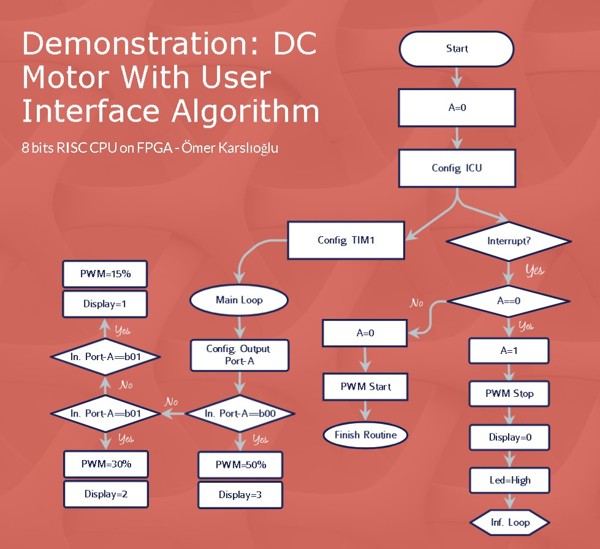
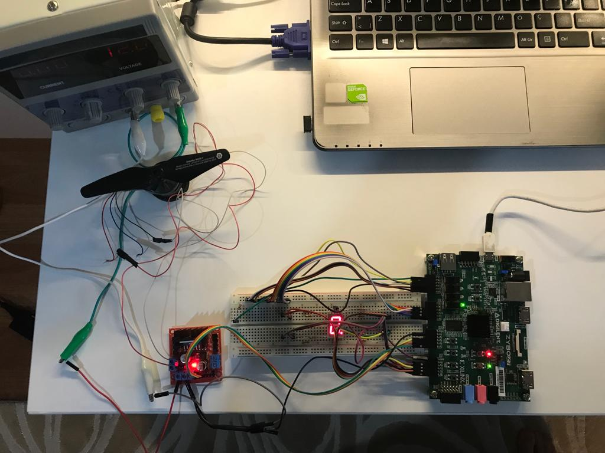

# Small SoC Design Based On Custom ISA

<p align="center">
  
</p>

The general aim of this project is to design a computer system that requires low cost, has high efficiency 8-bit register cells and has RISC instruction set architecture. 

This computer system is suitable for algorithms that can perform various arithmetic and logical operations and make decisions as a result of operations. 

The main components of this designed architecture are CPU, memory system, timer units and ICU. This processor supports 37 instructions and has various peripheral features such as interrupt and PWM generating. This designed computer was run on FPGA.

---

### File Tree

```
C:.
│   README.md
│
├───docs
│   │   architecture_doc.pdf
│   │   core_doc.pdf
│   │   core_presentation.pdf
│   │   soc_presentation.pdf
│   │
│   └───images
│
├───rtl
│   ├───core
│   │       alu.vhd
│   │       computer.vhd
│   │       control_unit.vhd
│   │       cpu.vhd
│   │       data_memory.vhd
│   │       data_path.vhd
│   │       memory.vhd
│   │       output_ports.vhd
│   │       program_memory.vhd
│   │
│   ├───ic
│   │       edge_detector.vhd
│   │       interrupt_controller_unit.vhd
│   │       port_interrupt_detector_unit.vhd
│   │
│   └───timer
│           clock_divider.vhd
│           counter.vhd
│           pwm_module.vhd
│           timer_top.vhd
│
└───tb
    ├───tb_core
    │       tb_computer.vhd
    │
    ├───tb_ic
    │       tb_ic.vhd
    │
    └───tb_timer
            tb_timer_module.vhd
```

---

### To Use The SoC

1- Clone the project

```
git clone https://github.com/omerkarslioglu/8_bit_risc_computer
```

2- Select the all VHDL files in RTL_Files folder and add your project.

3- You can write your Assembly code in program_memory.vhd as you want.

Note: You must follow the instruction guide ``architecture_doc.pdf`` to write assembly code. Also, If you examine the architecture of the computer, it will be good for you.

---

### The Demo Application

The demo algorithm flowchart:

<p align="center">
  
</p>

The algorithm works by following the steps below:

a) When the program starts, a variable is created and has zero initialize the value to use in interrupt serial routine for toggling. In the first interrupt, PWM generation will stop and after that, following another interrupt, PWM generation will start again (toggling process).

b) Interrupt Controller Unit (ICU) will be configured. After the configuration of ICU, the interrupt serial routine is activated thanks to ICU.

c) Timer1 will be configured for PWM.

d) After all configurations, the main loop will start. There are three modes as I mention. In main loops, the mode value will be read from input port-a. The value “00” – “01” – “10” in binary respectively represents fast-speed mode, mid-speed mode, and low-speed mode. In each stage, the seven-segment display will be updated according to modes.

e) In interrupt serial routine, as an addition to part ‘a’, timer configuration, led and the display will be updated.

<p align="center">
  
</p>

Demonstration Environment: It is a simulation environment figure consisting of FPGA, motor controller, DC motor, seven segment display and DC voltage source.
As seen in the picture above, this demonstration environment consists of Zybo Z20 SoC board, DC motor, DC motor controller, seven segment display and DC voltage source.

The computer architecture is implemented on the PL side of the Zybo Z20. Seven segment display and dc motor controller prepared with Zybo Z20 are directly connected. If the DC motor and DC voltage source are directly connected to the DC motor controller, the environment has been prepared and it has been observed that the computer is working properly.

---

Please, do not hesitate to ask me any question on your mind.

omerkarsliogluu@gmail.com

